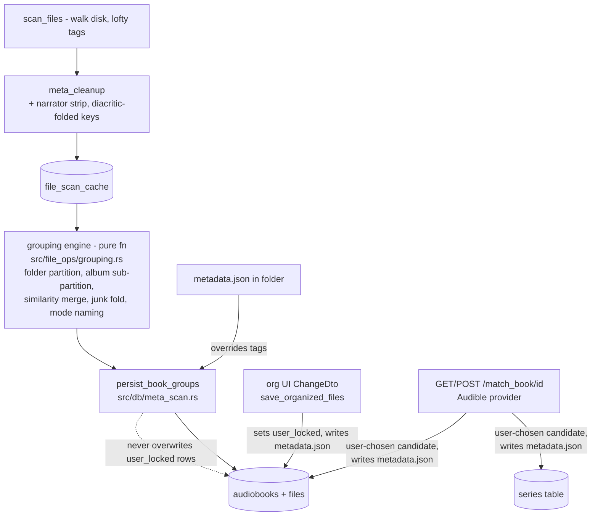

# Metadata Reconcile: Folder-Identity Grouping + Series Match API

## STATUS (2026-07-06)

Plan below was fully implemented and verified once already, in an isolated cloud
sandbox session that had no `origin` git remote configured. That implementation
(21 files, all tests passing, live smoke-tested) was committed locally there but
**never pushed anywhere reachable** — the sandbox is gone and the work is lost.
This checkout is unmodified (still has the original bug). **Needs re-implementation
from scratch**, following this plan. Nothing here has landed yet.

## Seekers
- [ ] Not started — see "Phases" below for execution order.

---

## Context

The uncommitted working-tree diff on `src/db/meta_scan.rs` (may or may not still
be present locally — check) fixed a real bug: book `title` was being set to the
album value. But it added `AND ab.title = fsc.clean_title` to the file→book join.
Since each chapter file has its own per-track `title` tag, every chapter becomes
its own book: the user's dev library shows **278 books × 1 file each**.

Tag-based grouping is unfixable for this library (verified against the real DB):
Húrin's folder has 2 author variants (`j.r.r. tolkien` vs
`j.r.r. tolkien (narr. christopher lee` — unclosed paren), 18 of 19 Hobbit files
have `album = rob inglis` (the narrator), Fellowship/Two Towers/RotK folders each
contain 2 album spellings. **Folder grouping is near-perfect**: every multi-file
folder is exactly one real book; the majority album value within a folder is the
correct display title (Audiobookshelf's model: folder = library item, tags only
name it).

**User constraints (locked):**
1. Folder = book identity; a folder holding N loose single-file books
   sub-partitions by album tag.
2. m4b parts vs `MP3/` chapter subfolder = 2 separate books (different
   `path_parent`); user merges via existing org UI.
3. External series match is an **explicit per-book user action** — never
   auto-applied on scan.
4. Keep the name `series` for the book-level field (column and JSON) — no rename
   to "album". The new normalized `series` table (real-world saga) is additive:
   exposed as `series_name`/`series_sequence`.
5. Include per-folder `metadata.json` persistence now.
6. Paid AI reconciliation = brainstorm only, recorded in notes, **no code**.
7. User reviews before commit (project convention) — do not commit without asking.

**Environment facts (verified against the repo):**
- `sqlx::query!` macros need a schema DB at `DATABASE_URL` (`.env`:
  `sqlite:./rustybookshelf.db`) to compile. If no `.sqlx` offline cache and no
  `sqlite3` CLI are available, bootstrap the schema DB with python3's `sqlite3`
  module, applying `migrations/*.up.sql` in order.
- `strsim = "0.11.1"` and `reqwest 0.12` (json + rustls) already in `Cargo.toml`.
  No new crates needed.
- `sqlx::migrate!()` runs on pool init (`src/db/mod.rs`). Next migration: `0003`.
- Dead legacy scanner: `scan_for_audiobooks`/`recursive_dirscan`/
  `capture_files_cover_paths`/`capture_metadata` in `src/file_ops/file_ops.rs` are
  reachable only via `db::cleanup`, whose only call site is commented out in
  `src/main.rs`. Safe to remove.
- Real library DB (`rustybookshelf.db`) is gitignored — verify with in-memory
  SQLite integration tests seeded with fixtures modeled on the real folders; do a
  manual local rescan afterward to confirm against the real library.

## Architecture after the change



Metadata precedence (low → high): tag-derived scan values < folder
`metadata.json` < in-DB user edits (`user_locked`). A rescan can never clobber
the two upper layers.

---

## Phase 0 — Environment bootstrap

1. Bootstrap `./rustybookshelf.db` from `migrations/*.up.sql` (python3's sqlite3
   module, or `sqlite3` CLI / `sqlx migrate run` if available) so `sqlx::query!`
   macros compile.
2. `cargo build` — must succeed with the existing working-tree diff before any
   new work. If it fails for schema reasons, fix the bootstrap, not the code.
3. Re-run this bootstrap every time a migration file is added/changed (delete
   `rustybookshelf.db*` first, re-apply all migrations).

**Check:** `cargo build` green.

---

## Phase 1 — Schema (migration `0003_series_and_locks`)

Rebuild `audiobooks` (SQLite can't `ALTER ... ADD UNIQUE`, and the identity
constraint itself must change):

```sql
CREATE TABLE IF NOT EXISTS series (
    id INTEGER PRIMARY KEY AUTOINCREMENT,
    name TEXT NOT NULL UNIQUE,
    provider TEXT,
    provider_id TEXT
);

-- Rebuild audiobooks: UNIQUE(author, title) was a relic of tag-identity and
-- wrongly merges e.g. an m4b edition and an MP3/ chapter folder of the same
-- book. New identity constraint: UNIQUE(files_location, title).
CREATE TABLE audiobooks_new (
    id INTEGER PRIMARY KEY AUTOINCREMENT,
    author TEXT NOT NULL,
    series TEXT,
    title TEXT NOT NULL,
    files_location TEXT NOT NULL,
    book_size INTEGER DEFAULT 0,
    cover_art TEXT,
    metadata TEXT,
    duration INTEGER DEFAULT 0,
    created_at TIMESTAMP NOT NULL DEFAULT CURRENT_TIMESTAMP,
    updated_at TIMESTAMP NOT NULL DEFAULT CURRENT_TIMESTAMP,
    series_id INTEGER REFERENCES series(id),
    series_sequence TEXT,       -- TEXT: sequences like "1.5" exist
    asin TEXT,
    narrated_by TEXT,
    user_locked INTEGER NOT NULL DEFAULT 0,   -- rescans never touch locked rows
    UNIQUE (files_location, title)
);
INSERT INTO audiobooks_new (id, author, series, title, files_location, book_size,
    cover_art, metadata, duration, created_at, updated_at)
SELECT id, author, series, title, files_location, book_size, cover_art, metadata,
    duration, created_at, updated_at FROM audiobooks;
DROP TABLE audiobooks;
ALTER TABLE audiobooks_new RENAME TO audiobooks;

-- Recreate the trigger + indexes dropped with the old table
CREATE TRIGGER update_audiobooks_timestamp AFTER UPDATE ON audiobooks
FOR EACH ROW BEGIN
    UPDATE audiobooks SET updated_at = CURRENT_TIMESTAMP WHERE id = NEW.id;
END;
CREATE INDEX IF NOT EXISTS idx_audiobooks_author ON audiobooks (author);
CREATE INDEX IF NOT EXISTS idx_audiobooks_title ON audiobooks (title);
```

Write the matching `down.sql` (rebuild the old shape, `UNIQUE(author,title)`,
drop `series`).

Update `src/models/audiobooks.rs::AudioBookRow`: add `series_id: Option<i64>`,
`series_sequence: Option<String>`, `asin: Option<String>`,
`narrated_by: Option<String>`, `series_name: Option<String>` (from a LEFT JOIN),
`user_locked: bool`. Update `list_all_books` (`src/db/audiobooks.rs`) to LEFT JOIN
`series` and select the new columns. JSON stays backward compatible — existing
fields unchanged, new fields additive.

**Check:** re-bootstrap DB, `cargo build` green.

---

## Phase 2 — Cleanup layer (`src/file_ops/meta_cleanup.rs`)

### 2a. Narrator strip
Add regex (tolerant of the **unclosed paren** seen in real data,
`"j.r.r. tolkien (narr. christopher lee"`):

```rust
static ref NARRATOR: Regex = Regex::new(
    r"(?i)[\(\[,]?\s*(?:narr(?:ated)?\.?\s*(?:by)?|read by)\s+(.+?)[\)\]]?\s*$"
).unwrap();
```

In `author_cleanup`, before `clean_metadata`: if `NARRATOR` matches, and
`metadata.narrated_by.is_none()`, set it to capture group 1 (trimmed); truncate
author at the match start; then clean the remainder. `narrated_by` already binds
in `save_metadata_to_cache` — no extra plumbing needed. Known residual (leave for
match/AI phases): author tag that is *only* a narrator name (`rob inglis`).

### 2b. Diacritic folding for matching keys
Add `pub fn fold_key(s: &str) -> String`: lowercase + map common Latin diacritics
to ASCII (á à â ä ã å→a, é è ê ë→e, í ì î ï→i, ó ò ô ö õ→o, ú ù û ü→u, ñ→n, ç→c,
ý ÿ→y). Used only for comparisons (Húrin == Hurin); stored display values keep
diacritics.

### 2c. Unit tests
Unclosed-paren case above; closed paren; `, read by X`; no-narrator input
unchanged; pre-existing `narrated_by` not overwritten; `fold_key("Húrin") ==
"hurin"`.

**Check:** `cargo test` green.

---

## Phase 3 — Grouping engine (the core rewrite)

### 3a. Pure grouping logic — new `src/file_ops/grouping.rs`

No DB access — makes the algorithm unit-testable in isolation.

```rust
pub struct GroupRow {
    pub fsc_id: i64,
    pub author: Option<String>,
    pub narrated_by: Option<String>,
    pub clean_series: Option<String>,  // album-derived; falls back to clean_title
                                        // upstream when no album tag exists
    pub clean_title: Option<String>,
    pub path_parent: String,
    pub cover_art: Option<String>,
}

pub struct BookGroup {
    pub path_parent: String,
    pub title: String,
    pub author: String,
    pub series: String,        // album/display value — column keeps name `series`
    pub narrated_by: Option<String>,
    pub cover_art: Option<String>,
    pub fsc_ids: Vec<i64>,
}

pub fn group_files(rows: Vec<GroupRow>) -> Vec<BookGroup>
```

Algorithm:
1. Partition rows by `path_parent`.
2. Within a folder, split into "junk" rows (album missing, or folded album ==
   folded author/narrator — it can't identify a book) vs "real" rows.
3. Sub-partition real rows by `fold_key(clean_series)`.
4. Merge partitions pairwise to fixpoint when similar: normalize by stripping a
   leading article ("the"/"a"/"an") and trailing digits/punctuation, then match
   on equality, substring containment (min length ≥ 5), shared-prefix ratio
   ≥ 0.5, or normalized levenshtein similarity ≥ 0.75 (`strsim::levenshtein`).
   Handles Fellowship's 2 album spellings → 1 book.
5. Place junk rows: 1 real partition → junk joins it (Hobbit: 18×`album=rob
   inglis` + 1 real → 1 book). Several real partitions → only a dominant one
   (≥50% of the folder) absorbs junk. Zero real partitions → junk forms its own
   partition, naming falls back to per-title (loose-files case).
6. Per final partition compute, **preferring non-junk rows so junk values can't
   outvote the real name**: `title = mode(clean_series) if file_count > 1 else
   clean_title.or(clean_series)`; `author = mode(author)`; `series =
   mode(clean_series)`; `narrated_by = mode(narrated_by)`; `cover_art` = first
   non-None. Fall back to folder basename if nothing else names the book.

### 3b. Persistence — rewrite in `src/db/meta_scan.rs`

Replace `insert_new_books_from_cache` + `insert_new_files_from_cache` with:

```rust
pub async fn group_and_attach_files(pool: &SqlitePool) -> Result<Vec<i64>, ApiError>
```

1. `SELECT id, author, narrated_by, clean_series, clean_title, path_parent,
   cover_art FROM file_scan_cache WHERE resolve_status = 0` → `group_files()`.
2. Per `BookGroup`, resolve the book id:
   - `SELECT id, title, series, user_locked FROM audiobooks WHERE
     files_location = ?`; among candidates pick the one whose folded
     `series`/`title` passes the same similarity test as 3a (similarity pick,
     not first-row — multiple loose books legitimately share a
     `files_location`).
   - **Found**: if `user_locked == 0` and (multi-file or came from
     metadata.json) and stored title/author differ → `UPDATE` (self-heals the
     "first uploaded chapter created the book" case). If `user_locked == 1`,
     attach files only, no rename.
   - **Not found**: `INSERT ... ON CONFLICT(files_location, title) DO UPDATE SET
     updated_at = CURRENT_TIMESTAMP RETURNING id` (the same book at a *different*
     location intentionally stays a separate row — constraint 2 — the user
     merges manually).
3. File attach with the exact `fsc_id → book_id` map: batch `INSERT OR IGNORE
   INTO files (...)` — reuse the existing `QueryBuilder`/`bind_ids` pattern
   already in this file. Idempotent via `UNIQUE(book_id, file_id, file_path)`.
4. Change `update_fsc_resolved_status` to take `processed_ids: &[i64]` and scope
   the UPDATE — no longer marks unrelated rows resolved.
5. `sync_disk_db_state` becomes: `save_metadata_to_cache` →
   `group_and_attach_files` → scoped `update_fsc_resolved_status` →
   `update_duration_file_sz` (unchanged). Note: `scan_files` feeds this in
   500-row chunks, so a folder can split across calls — that's fine, later
   chunks re-resolve the same book via `files_location` + similarity.

### 3c. Delete dead code
`src/file_ops/file_ops.rs` (`scan_for_audiobooks`, `recursive_dirscan`,
`has_dirs`, `capture_files_cover_paths`, `capture_metadata`), `src/db/mod.rs::
cleanup` + its now-commented call site in `main.rs`, and any now-unreferenced
functions in `src/db/audiobooks.rs` / `src/models/audiobooks.rs::AudioBook`.
Rule: delete, `cargo build`, restore anything the compiler proves still live.

### 3d. Integration tests
In-memory SQLite + `sqlx::migrate!()`, fixtures modeling the real folders:
Húrin (128 files, 1 album → 1 book), Hobbit (18×junk album + 1 real → 1 book,
correct title), Fellowship (m4b 3 files + MP3/ 31 files across 2 similar album
spellings → 2 books, 3+31), loose files (4 dissimilar albums, one folder → 4
books), idempotency (rescan doesn't duplicate/rename), chunked-upload self-heal
(1 file creates book, rest attach + rename), `user_locked` survives rescan.

**Check:** `cargo build`, `cargo clippy`, `cargo test` green.

---

## Phase 4 — user_locked wiring (org UI edits become the top layer)

In `save_user_file_org_changes_filescan_cache`:
- `Rename`/`MoveTitle`: set `user_locked = 1` in the same UPDATE as the rename.
- `FileMove`: set `user_locked = 1` on the destination book (both existing-book
  and negative-id-insert paths).
- `MergeTitle`: set `user_locked = 1` on `new_book_id`.
- Track touched book ids; after all changes, call `write_book_meta_json` for
  each (Phase 6 hook).

`ChangeDto` needs no shape changes — API stays compatible.

**Check:** apply a Rename in an in-memory DB, assert `user_locked = 1`, rerun
grouping, assert the rename survives.

---

## Phase 5 — Series match API (explicit user action)

### 5a. Provider client — new `src/services/audible.rs`
Free, no-key Audible catalog search (what Audiobookshelf uses):
`GET https://api.audible.com/1.0/catalog/products?title=…&author=…&response_groups=contributors,series,media,product_desc`.
`search_products(title, author) -> Result<Vec<MatchCandidate>, ApiError>`,
10s timeout, empty/missing fields → `None`s, permissive serde structs.
Alternatives noted for later (comment only): Audnexus, Audimeta.de, Open
Library.

### 5b. DTO — new `src/models/match_meta.rs`
`MatchCandidate { title, author, narrator, series_name, series_sequence, year,
asin, cover_url, confidence }`. `ApplyMatchDto` wraps it + `apply_title_author:
bool` for the POST body.

### 5c. DB — new `src/db/series.rs`
`upsert_series(pool, name, provider, provider_id)` (`ON CONFLICT(name) DO
UPDATE ... RETURNING id`), `set_book_match(pool, book_id, series_id, sequence,
asin, title_author)` (sets `user_locked=1` only when title/author are applied),
`get_book_title_author`.

### 5d. Handlers — new `src/api/match_meta.rs`
- `GET /match_book/{book_id}` (`AuthUser`-guarded, optional `?q=` override):
  look up book → `search_products` → confidence = normalized levenshtein
  similarity of folded title+author vs the book's → sorted candidates. **Read-
  only** — nothing stored; a strong hit confirms Phase-3 grouping, a miss flags
  for review.
- `POST /match_book/{book_id}`, body = chosen candidate: upsert series row
  (provider `"audible"`, provider_id = asin), `set_book_match`, then
  `write_book_meta_json` (Phase 6). Idempotent.
- Add both requests to `http/req.http`.

**Check:** unit test deserializing a canned Audible JSON sample into
`Vec<MatchCandidate>`; `cargo build`/`clippy` green. Attempt one live call in
Phase 7 (may be blocked by network policy in a sandbox — note if so).

---

## Phase 6 — Per-folder `metadata.json` (portable, survives DB loss)

New `src/file_ops/book_meta_file.rs`:

```rust
pub struct BookMetaFile {
    pub version: u32,
    pub title: String,
    pub author: String,
    pub series: Option<String>,
    pub narrated_by: Option<String>,
    pub series_name: Option<String>,
    pub series_sequence: Option<String>,
    pub asin: Option<String>,
    pub user_locked: bool,
}
```

- `write_book_meta_json(pool, book_id)`: load the book (+ series name via
  join); **only write if this book is the folder's sole book**
  (`files_location` maps to exactly 1 row — loose-files case is ambiguous,
  skip with a warning). Write `{files_location}/metadata.json`. FS failures are
  warned, never propagated — DB stays the source of truth, the file is a
  portable copy.
- `read_book_meta_json(path_parent)`: read + parse, `None` on any failure.
- Reader hook in `group_and_attach_files`: when a folder maps to exactly one
  group in the current batch, check for `metadata.json` first; if present,
  override the group's `title/author/series/narrated_by` before resolving the
  book id, and carry its `user_locked` flag through to the INSERT/UPDATE.
- Writer call sites: end of the org-change handler (Phase 4) per touched book,
  and after POST `/match_book` (Phase 5).

**Check:** integration test with a real temp-dir `metadata.json` → book created
from its values, `user_locked` honored; org-change test asserts the file round-
trips.

---

## Phase 7 — Verification

1. Re-bootstrap schema DB (all 3 migrations), `cargo build`, `cargo clippy`,
   `cargo test` — all green.
2. Smoke-run the server against a scratch DB + scratch audiobook folder (not
   the real library): login → scan_files → list_books → POST match → GET
   match (idempotent) → check `metadata.json` written → confirm new
   `AudioBookRow` fields appear in `/list_books`.
3. Attempt one live provider call — if network policy blocks it (sandboxes
   often do), note that and defer live-provider verification to the user's
   local run.
4. **Do not commit** — per project convention, present the diff for review
   first.
5. User's own verification checklist against the real library, once reviewed:
   `DELETE FROM files; DELETE FROM audiobooks; UPDATE file_scan_cache SET
   resolve_status = 0;` → `/scan_files` → expect ~20-24 books (was 278); Húrin
   = 1 book/128 files; Hobbit = 1 book/19 files despite `rob inglis` albums;
   Fellowship m4b + MP3 = 2 books (3 + 31); narrator strip visible via
   `SELECT author, narrated_by FROM file_scan_cache WHERE narrated_by IS NOT
   NULL LIMIT 5`; `GET /match_book/{id}` for The Silmarillion returns LotR-
   series candidates; POST one → series row + fields set + `metadata.json`
   written; re-POST idempotent.

## Files touched (summary)

| File | Action |
|---|---|
| `migrations/0003_series_and_locks.{up,down}.sql` | new |
| `src/file_ops/meta_cleanup.rs` | narrator strip, `fold_key`, tests |
| `src/file_ops/grouping.rs` | new — pure grouping engine + tests |
| `src/file_ops/book_meta_file.rs` | new — metadata.json read/write |
| `src/file_ops/file_ops.rs` | delete dead legacy scanner |
| `src/db/meta_scan.rs` | `group_and_attach_files`, scoped resolve status, user_locked wiring, integration tests |
| `src/db/series.rs` | new — series upserts/match update |
| `src/db/audiobooks.rs` | `list_all_books` join + prune dead fns |
| `src/db/mod.rs` | register series module, delete `cleanup` |
| `src/models/audiobooks.rs` | AudioBookRow new fields, prune `AudioBook` |
| `src/models/match_meta.rs` | new — MatchCandidate |
| `src/services/audible.rs` | new — provider client |
| `src/services/mod.rs`, `src/models/mod.rs`, `src/file_ops/mod.rs` | module registrations |
| `src/api/match_meta.rs` | new — GET/POST handlers |
| `src/api/mod.rs` | routes |
| `src/main.rs` | remove commented `cleanup` call |
| `http/req.http` | match_book requests |

## Phase 8 (brainstorm only, no code) — Paid AI reconciliation

One-time-fee endpoint: send **deduplicated** author/album/title strings +
folder shapes (not per-file raw metadata — a few hundred short strings for this
library) to a Haiku-class model, ask it to propose canonical author names, book
titles, series memberships, and merge operations. Output shaped as
`Vec<ChangeDto>` so the **existing** `save_organized_books`/
`save_user_file_org_changes_filescan_cache` machinery applies it after user
review in the org UI — no new merge-execution code. Solves residuals
regex/API can't (author tag = narrator only, misspellings, translated titles).
Open items: payment gating, batching, review UI.

## Recorded direction (not implemented, kept for later)

1. Disk structure is identity, tags are display — Phase 3 moves onto this
   model without a full rewrite of the rest of the app.
2. Layered metadata precedence (scanned < metadata.json < user `user_locked`)
   — implemented here for books; could extend to per-field granularity later.
3. `audiobooks.series` is really "album"; honest rename deferred — user chose
   to keep the name `series`.
4. Diacritic folding only applied to matching keys, not stored values — could
   extend to search/filter UX later.
